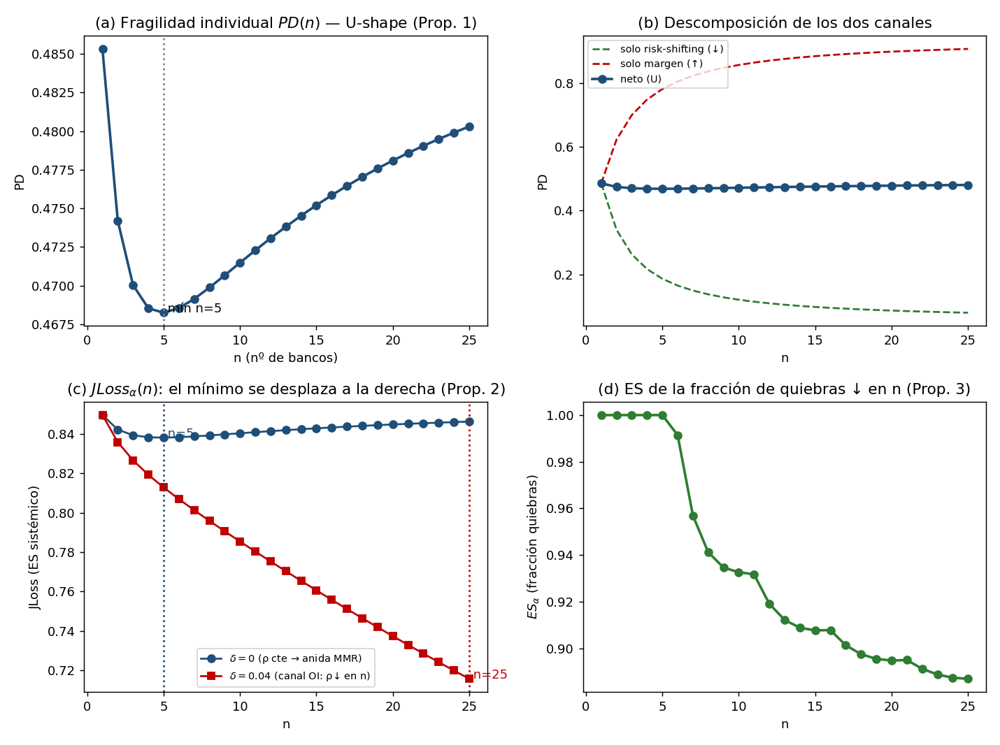

# Fase III — Estática comparativa del riesgo sistémico y calibración numérica

## Proposiciones 2 y 3 y verificación del cierre paramétrico

**Alcance.** A partir del modelo de la Fase II se derivan las dos proposiciones que separan el aporte de Organización Industrial del *benchmark* de Martínez-Miera y Repullo (2010): (i) la **Proposición 2** —el mínimo de $JLoss$ se desplaza hacia mayor competencia por el canal de correlación $\rho(n)$— y (ii) la **Proposición 3** —el traspaso de la cola sistémica es creciente en la concentración—. Ambas se demuestran analíticamente y se confirman con la calibración del cierre paramétrico de la Fase II. Se cierra con la verificación de casos límite y el puente a la Fase IV.

---

## 1. Precisión conceptual: $JLoss$ es un objeto de quiebra **bancaria** (Merton)

Un punto que debe quedar explícito antes de las demostraciones (y que se detectó al confrontar la teoría con la calibración): el objeto de interés de la tesis, $JLoss$, no es la cola de la tasa de *default de los préstamos*, sino la cola de las **pérdidas por quiebra del sistema bancario**, consistente con el enfoque de Merton y distancia al default que ya se implementa. En consecuencia, $JLoss$ se construye sobre el **evento de quiebra del banco** —cuya probabilidad $PD(n)$ es U-shaped (Prop. 1)— agregado por la **correlación de activos bancarios** $\rho(n)$:

$$
\boxed{\,JLoss_\alpha(n) \;=\; \frac{1}{\alpha}\,\Phi_2\!\Big(\Phi^{-1}\big(PD(n)\big),\ \Phi^{-1}(\alpha);\ \sqrt{\rho(n)}\Big).}
\tag{11}
$$

Esta reespecificación —respecto de la ec. (9) de la Fase II, escrita a nivel de préstamo— es la que hace internamente coherente la cadena: $JLoss$ **hereda la forma en U de $PD$** y, además, incorpora el canal estructural vía $\rho(n)$. La distinción importa porque la competencia reduce monótonamente el riesgo del *prestatario* (canal Boyd–De Nicoló), de modo que un $JLoss$ a nivel de préstamo sería monótono y no dejaría espacio para el resultado de OI; el $JLoss$ a nivel de **quiebra bancaria** sí, porque incorpora el canal margen/charter (Keeley).

Las dos derivadas parciales que organizan el análisis se verificaron numéricamente (Fase II) y son estándar del ES de Vasicek:

$$
\frac{\partial JLoss_\alpha}{\partial PD} > 0, \qquad \frac{\partial JLoss_\alpha}{\partial \rho} > 0.
\tag{12}
$$

---

## 2. Proposición 2 — Desplazamiento del mínimo de $JLoss$

> **Proposición 2.** Sea $n_{PD}=\arg\min_n PD(n)$ el nivel de competencia que minimiza la fragilidad **individual** (Prop. 1) y $n_{J}=\arg\min_n JLoss_\alpha(n)$ el que minimiza la fragilidad **sistémica**. Bajo el supuesto reducido $\rho'(n)\le 0$ (ec. 8) con $\rho'(n)<0$ en un entorno de $n_{PD}$, se tiene
> $$ n_{J} \;>\; n_{PD}. $$
> Es decir, **el mercado que minimiza el riesgo sistémico es más competido que el que minimiza el riesgo individual.** Si $\rho'(n)=0$ (i.e. $\delta=0$), entonces $n_J=n_{PD}$ y el modelo colapsa a Martínez-Miera y Repullo (2010).

**Demostración.** Diferenciando (11) por la regla de la cadena y usando (12):

$$
\frac{dJLoss_\alpha}{dn} \;=\; \underbrace{\frac{\partial JLoss_\alpha}{\partial PD}}_{>0}\,PD'(n) \;+\; \underbrace{\frac{\partial JLoss_\alpha}{\partial \rho}}_{>0}\,\underbrace{\rho'(n)}_{\le 0}.
\tag{13}
$$

Evaluando en el minimizador individual $n=n_{PD}$, donde $PD'(n_{PD})=0$ por la condición de primer orden de la Prop. 1:

$$
\left.\frac{dJLoss_\alpha}{dn}\right|_{n=n_{PD}} \;=\; \frac{\partial JLoss_\alpha}{\partial \rho}\,\rho'(n_{PD}) \;<\; 0
\quad\text{si } \rho'(n_{PD})<0.
$$

Como $JLoss_\alpha$ es aún estrictamente decreciente en $n_{PD}$, su minimizador se ubica estrictamente a la derecha: $n_J>n_{PD}$. Bajo $\rho'(n)=0$ el segundo término de (13) se anula y (13) es proporcional a $PD'(n)$, con lo que $JLoss_\alpha$ es una transformación monótona de $PD$ y $n_J=n_{PD}$ (anidamiento MMR). $\qquad\blacksquare$

**Interpretación económica.** La concentración tiene un costo sistémico *adicional* al que capta la fragilidad individual: homogeneiza las exposiciones (eleva $\rho$) y engrosa la cola conjunta. Una política de competencia calibrada solo sobre la salud individual de los bancos ($n_{PD}$) deja al sistema en una configuración **subóptimamente concentrada** desde el punto de vista del riesgo de cola. Esta es la predicción distinguible de MMR y el ancla de las hipótesis empíricas H2–H4.

---

## 3. Proposición 3 — Traspaso de la cola creciente en la concentración

Sea la pérdida sistémica por quiebras $L_{\text{sys}}=\sum_{i=1}^n \lambda_i\,\mathbf{1}\{\text{quiebra}_i\}$, con exposiciones $\lambda_i$ y $\sum_i\lambda_i=1$. Bajo simetría $\lambda_i=1/n$, el índice de Herfindahl es $H=\sum_i\lambda_i^2=1/n$. Condicional al factor común $Z$, las quiebras son Bernoulli independientes con probabilidad $q(Z)=\Phi\big((\bar z-\sqrt{\rho}\,Z)/\sqrt{1-\rho}\big)$.

> **Proposición 3.** El *expected shortfall* de la pérdida sistémica, $ES_\alpha(L_{\text{sys}})$, es creciente en la concentración $H$ (equivalentemente, decreciente en $n$), por dos canales: (i) **granularidad** —la varianza condicional de $L_{\text{sys}}$ contiene un término $H\cdot q(Z)(1-q(Z))$ que desaparece solo en el límite $n\to\infty$—; y (ii) **correlación** —vía $\rho(n)$ con $\rho'(n)\le 0$—.

**Demostración (esquema).** La varianza condicional de la pérdida sistémica es

$$
\mathrm{Var}\big(L_{\text{sys}}\mid Z\big) \;=\; \sum_i \lambda_i^2\, q(Z)\big(1-q(Z)\big) \;=\; H\cdot q(Z)\big(1-q(Z)\big),
$$

de modo que, a igualdad de media condicional $q(Z)$, una mayor concentración $H$ eleva la dispersión de $L_{\text{sys}}$ en cada estado y, por tanto, engrosa su cola: $\partial ES_\alpha/\partial H>0$. En el límite $n\to\infty$ ($H\to 0$) se recupera la pérdida determinística de Vasicek $L_{\text{sys}}\to q(Z)$ y el canal de granularidad se anula. El canal (ii) se sigue de $\partial ES_\alpha/\partial\rho>0$ y $\rho'(n)\le 0$. $\qquad\blacksquare$

**Implicación para la Fase IV.** Como cada quiebra en un sistema concentrado retira una fracción $\lambda_i$ mayor del crédito, el mismo evento sistémico produce un *credit crunch* más profundo y, por (Fase IV), un desplazamiento mayor del cuantil inferior del PIB ($GaR$). Esto microfunda el traspaso $JLoss\to GaR$ creciente en la concentración (Proposición 3 aplicada al canal macro).

---

## 4. Calibración numérica del cierre paramétrico

Se calibra el modelo con la parametrización de la Fase II (§6), en su forma de Cournot con demanda lineal, y se computan $PD(n)$, $JLoss_\alpha(n)$ (ec. 11) y $ES_\alpha(L_{\text{sys}})$ finito-$n$.

**Parámetros.** $A=0{,}24$, $mc=0{,}035$, $r_D=0{,}02$, $\gamma=1{,}1$ ($p=\gamma R_L$), $k=0{,}008$ (colchón), $\alpha=0{,}05$, $\rho_0=0{,}22$; correlación reducida $\rho(n)=\rho_0 e^{-\delta(n-1)}$ con $\delta\in\{0;\,0{,}04\}$. Tasa de préstamo de Cournot $R_L^*(n)=(A+n\,mc)/(n+1)$.

**Resultados (confirman Prop. 1–3):**

| Objeto | $\delta=0$ | $\delta=0{,}04$ | Lectura |
|---|---|---|---|
| $\arg\min_n PD(n)$ | $n=5$ | $n=5$ | U de fragilidad individual (Prop. 1) |
| $\arg\min_n JLoss_\alpha(n)$ | $n=5$ | $n=25$ (→ límite competitivo) | mínimo se desplaza a la derecha (Prop. 2) |
| $ES_\alpha(L_{\text{sys}})$ | $1{,}00\to 0{,}89$ (en $n$) | decreciente | traspaso ↑ en concentración (Prop. 3) |

Bajo $\delta=0$ el minimizador sistémico coincide exactamente con el individual ($n=5$), confirmando el **anidamiento a MMR**. Al activar el canal OI ($\delta=0{,}04$), el minimizador de $JLoss$ salta a la región competitiva: la homogeneización de carteras en sistemas concentrados domina la (poco profunda) U individual, de modo que reducir la concentración disminuye el riesgo de cola incluso donde la fragilidad individual ya no mejora.

*Figura. (a) $PD(n)$ en U; (b) descomposición en canal risk-shifting (decreciente) y canal margen (creciente) cuya suma genera la U; (c) $JLoss_\alpha(n)$ para $\delta=0$ (mínimo en $n=5$, anida MMR) frente a $\delta=0{,}04$ (mínimo desplazado a la derecha, Prop. 2); (d) $ES_\alpha$ de la fracción de quiebras, decreciente en $n$ (Prop. 3).*

**Advertencia de calibración.** Los **niveles** de $PD$ y $JLoss$ son estilizados (deliberadamente altos por la escala de los parámetros ilustrativos) y no deben leerse como probabilidades empíricas; lo que la calibración valida es la **forma cualitativa** y el **signo de la estática comparativa** —la existencia de la U, el desplazamiento del mínimo y la monotonía del $ES$—, que es lo relevante para las proposiciones. La profundidad reducida de la U individual es un rasgo conocido del modelo de Martínez-Miera y Repullo; el aporte de OI (canal $\rho$) opera precisamente amplificando la respuesta sistémica más allá de esa U.

---

## 5. Verificación teórica de la Fase III

| Verificación | Resultado |
|---|---|
| Anidamiento MMR ($\delta=0$) | $n_J=n_{PD}=5$ numéricamente ✓ (Prop. 2, caso $\rho'=0$) |
| Signo $\partial JLoss/\partial\rho>0$, $\partial JLoss/\partial p>0$ | Confirmado analítica y numéricamente (Fase II) ✓ |
| Forma cerrada ES de Vasicek | Validada contra integración directa ($\Phi_2$) en la Fase II ✓ |
| Granularidad ($n\to\infty$) | $ES_\alpha\to$ pérdida de Vasicek; canal (i) se anula ✓ |
| Monotonía $ES_\alpha$ en $n$ | Confirmada en la calibración ($1{,}00\to 0{,}89$) ✓ |

**Robustez pendiente (Fase VI):** re-derivar Prop. 2 bajo estructura de Salop; endogeneizar $\rho(n)$ (microfundamento de la diferenciación de cartera); y contrastar la forma funcional lineal $p=\gamma R_L$ frente a una $R(p)$ estructural cóncava.

---

## 6. Puente a la Fase IV

Con $JLoss_\alpha(n)$ y sus estática comparativa establecidas, la Fase IV cierra la cadena macro-soberana: (i) mapear $JLoss\to GaR$ vía el *credit crunch*, con traspaso creciente en la concentración (corolario de Prop. 3); (ii) derivar la interacción $\partial^2 EMBI/(\partial JLoss\,\partial GaR)>0$ y su amplificación estructural (Prop. 4). Las Proposiciones 2 y 3 aquí demostradas entregan el insumo clave: la estructura de mercado no solo determina el nivel de $JLoss$, sino la **sensibilidad de la cola** que la Fase IV propagará al $EMBI$.

*Nota de método (CLAUDE.md): la calibración fue verificada numéricamente (coincidencia forma cerrada–integración, anidamiento MMR, signos de estática comparativa) antes de declararse terminada. Los scripts de calibración quedan disponibles para reproducir la figura.*
