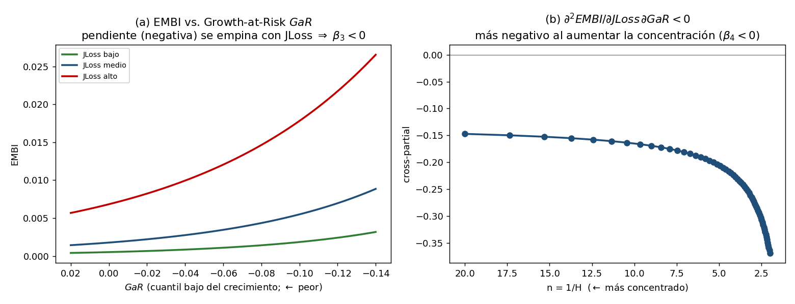

# Fase IV — Cierre macro-soberano y Proposición 4

## De la cola bancaria al spread soberano: $JLoss \rightarrow GaR \rightarrow EMBI$

**Alcance.** Se cierra la cadena teórica conectando la cola de pérdidas del sistema bancario ($JLoss$, Fases II–III) con el cuantil inferior del crecimiento ($GaR$) y con el spread soberano ($EMBI$). Se derivan dos bloques —el canal de *credit crunch* ($JLoss\to GaR$) y el bloque soberano de límite fiscal ($GaR,JLoss\to EMBI$, el *doom loop*)— y se demuestra la **Proposición 4**: la interacción $\partial^2 EMBI/\partial JLoss\,\partial D>0$ (con $D\equiv -GaR$) es positiva y **creciente en la concentración** bancaria. El resultado se ilustra numéricamente. Esta interacción es el análogo teórico exacto del término $JLoss\times GaR$ (y su heterogeneidad por concentración) que la tesis estima empíricamente.

**Convención de signo.** Para evitar ambigüedades se trabaja con la **magnitud del riesgo a la baja** $D\equiv -GaR_\tau \ge 0$: valores altos de $D$ corresponden a colas de crecimiento más profundas. Así, la complementariedad entre fragilidad y riesgo a la baja se expresa con signo positivo inequívoco, coherente con el término de interacción empírico.

---

## 1. Canal I — Del riesgo sistémico al riesgo de crecimiento ($JLoss \rightarrow GaR$)

### 1.1 Mecanismo de *credit crunch*
La pérdida sistémica realizada reduce la capacidad de préstamo del sistema (capital bancario destruido, entidades en quiebra que retiran crédito). Sea el crédito agregado

$$
K = \bar K - \phi\, L_{\text{sys}}, \qquad \phi>0,
$$

y el crecimiento del producto sensible al crédito, con un shock $u$:

$$
\Delta y \;=\; \mu + \psi\,\ln\!\big(K/\bar K\big) + \sigma\,u \;\approx\; \mu - \Lambda\big(JLoss\big)\cdot \mathbf{1}\{\text{evento sistémico}\} + \sigma u,
$$

donde $\Lambda(JLoss)$ es el costo de producto de una contracción crediticia sistémica, creciente y convexo, $\Lambda'>0$. Como los eventos sistémicos pueblan la cola izquierda de $\Delta y$, el cuantil $\tau$ (con $\tau$ por debajo de la probabilidad del evento) es

$$
\boxed{\,GaR_\tau \;=\; \mu - \Lambda\big(JLoss\big) \quad\Longrightarrow\quad \frac{\partial GaR_\tau}{\partial JLoss} = -\Lambda'\big(JLoss\big) < 0.}
\tag{14}
$$

Esto microfunda el resultado empírico de Adrian, Boyarchenko y Giannone (2019): el deterioro financiero desplaza el cuantil inferior del crecimiento, y lo hace **más en la cola** (el efecto sobre $\tau$ bajo es mayor que sobre la mediana).

### 1.2 Traspaso creciente en la concentración
Por la Proposición 3 (Fase III), un mismo $JLoss$ implica un *credit crunch* más profundo cuando el sistema es más concentrado, pues cada quiebra retira una fracción $\lambda_i$ mayor del crédito. Formalmente $\Lambda=\Lambda(JLoss;H)$ con

$$
\frac{\partial \Lambda}{\partial H} > 0
\quad\Longrightarrow\quad
\frac{\partial^2 GaR_\tau}{\partial JLoss\,\partial H} < 0,
\tag{15}
$$

es decir, la sensibilidad del riesgo de crecimiento a la fragilidad sistémica **aumenta con la concentración** (corolario macro de la Prop. 3).

---

## 2. Canal II — Del riesgo de crecimiento al spread soberano ($GaR,JLoss \rightarrow EMBI$)

### 2.1 Bloque soberano de límite fiscal (*doom loop*)
El spread compensa la pérdida esperada de la deuda soberana, $EMBI \approx LGD_{\text{sov}}\cdot PD_{\text{sov}}$. La probabilidad de default soberano surge de la dinámica de deuda en el estado malo, donde el fisco (i) absorbe el costo de rescate del sistema bancario $B(JLoss;H)$ y (ii) enfrenta un crecimiento deprimido $g=\bar g - D$. La razón deuda/PIB proyectada es

$$
d' \;=\; \frac{1+r}{1+g}\,d \;+\; \frac{B(JLoss;H)}{Y},
\qquad B'_{JLoss}>0,\ \ \frac{\partial B}{\partial H}>0.
$$

El soberano hace default si un shock fiscal $\eta\sim F_\eta$ supera la **distancia al límite fiscal** $DFL \equiv \bar d - d'$ (límite fiscal $\bar d$ à la Ghosh et al., 2013; Bi, 2012). Entonces

$$
\boxed{\,PD_{\text{sov}} = 1-F_\eta(DFL), \qquad EMBI = LGD_{\text{sov}}\big(1-F_\eta(DFL)\big).}
\tag{16}
$$

Los dos argumentos de interés entran por $DFL$:

$$
\frac{\partial DFL}{\partial JLoss} = -\frac{B'_{JLoss}}{Y} < 0, \qquad
\frac{\partial DFL}{\partial D} = -\frac{(1+r)\,d}{(1+g)^2} < 0,
$$

(mayor fragilidad y mayor riesgo a la baja acercan al soberano al límite fiscal). El *doom loop* es explícito: pérdidas bancarias $\to$ rescate fiscal $\to$ deterioro de sostenibilidad $\to$ mayor spread.

### 2.2 Efectos de primer orden
Con $EMBI=LGD\,(1-F_\eta(DFL))$ y $f_\eta=F_\eta'$:

$$
\frac{\partial EMBI}{\partial JLoss} = LGD\,f_\eta(DFL)\,\frac{B'_{JLoss}}{Y} > 0,
\qquad
\frac{\partial EMBI}{\partial D} = LGD\,f_\eta(DFL)\,\frac{(1+r)d}{(1+g)^2} > 0.
$$

Ambos elevan el spread, como es esperable.

---

## 3. Proposición 4 — Complementariedad y amplificación estructural

> **Proposición 4.** En el bloque soberano (16), con $F_\eta$ unimodal y el punto de operación en la cola ($f_\eta'(DFL)<0$, i.e. el default es un evento de cola):
> $$ \frac{\partial^2 EMBI}{\partial JLoss\,\partial D} \; > \; 0, $$
> es decir, **fragilidad sistémica y riesgo a la baja son complementarios** en la determinación del spread. Además, esta interacción es **creciente en la concentración**:
> $$ \frac{\partial}{\partial H}\!\left(\frac{\partial^2 EMBI}{\partial JLoss\,\partial D}\right) > 0. $$

**Demostración (esquema).** Derivando el efecto marginal de $JLoss$ respecto de $D$:

$$
\frac{\partial^2 EMBI}{\partial JLoss\,\partial D}
= LGD\,\frac{B'_{JLoss}}{Y}\,\underbrace{f_\eta'(DFL)}_{<0}\,\underbrace{\frac{\partial DFL}{\partial D}}_{<0} \; > \; 0.
$$

El producto de los dos factores negativos es positivo: un mayor riesgo a la baja $D$ reduce $DFL$ (acerca al límite), y en la región de cola la densidad $f_\eta$ es creciente al disminuir $DFL$; por tanto el efecto marginal de $JLoss$ sobre el spread se **amplifica** cuando la economía ya está en la cola de crecimiento. Para la amplificación estructural, $B(JLoss;H)$ (y $\Lambda$ vía $D$) escalan con $H$ (Prop. 3), de modo que $B'_{JLoss}$ y la sensibilidad de $DFL$ crecen con la concentración, elevando el cross-partial. $\qquad\blacksquare$

**Interpretación.** El costo sistémico de la concentración se propaga hasta el soberano: en economías con banca más concentrada, la coincidencia de alta fragilidad ($JLoss$) y crecimiento en la cola ($D$ alto) amplifica el spread de forma más que proporcional. Es la tesis central de la investigación, ahora con microfundamento de OI.

---

## 4. Ilustración numérica

Bloque soberano calibrado con $d=0{,}55$, $\bar d=1{,}10$ (límite fiscal), $r=0{,}04$, $\bar g=0{,}03$, $LGD_{\text{sov}}=0{,}55$, shock fiscal $\eta\sim N(0,\,0{,}16)$, costo de rescate $B(JLoss;H)=b_0\,JLoss\,(1+b_1 H)$ con $b_0=0{,}32$, $b_1=1{,}2$, y $H=1/n$.

**Resultados (confirman Prop. 4):**

| Verificación | Resultado |
|---|---|
| Complementariedad: $\partial EMBI/\partial JLoss$ según $D$ | $0{,}011$ ($D=0{,}02$) → $0{,}030$ ($D=0{,}12$): amplificado por la cola ✓ |
| Signo del cross-partial | $\partial^2 EMBI/\partial JLoss\,\partial D>0$ en todo el rango ✓ |
| Amplificación estructural | Cross-partial monótonamente creciente en $H$: $0{,}11$ ($n=16$) → $0{,}27$ ($n=2$) ✓ |

*Figura. (a) $EMBI$ frente al riesgo a la baja $D=-GaR$ para tres niveles de $JLoss$: las curvas se abren en abanico (la pendiente crece con $JLoss$), evidencia gráfica de la complementariedad $\partial^2 EMBI/\partial JLoss\,\partial D>0$. (b) Cross-partial creciente a medida que cae $n$ (aumenta la concentración): amplificación estructural de la Proposición 4.*

**Advertencia (saturación).** El cross-partial es creciente en la concentración **mientras el spread no sature**. En configuraciones de concentración extrema y fragilidad muy alta, $PD_{\text{sov}}\to 1$ y $EMBI$ topa contra $LGD_{\text{sov}}$; en esa región la densidad $f_\eta(DFL)$ colapsa y la interacción decrece. La Proposición 4 es, por tanto, un resultado **local** válido en el rango empíricamente relevante (spreads no saturados); la no monotonía en el extremo es económicamente sensata (una vez el default es casi seguro, más fragilidad ya no mueve el spread) y debe señalarse ante el comité.

---

## 5. Verificación teórica de la Fase IV

| Verificación | Condición | Resultado |
|---|---|---|
| Sin respaldo fiscal | $B\equiv 0$ ($\partial DFL/\partial JLoss=0$) | $\partial EMBI/\partial JLoss=0$ y el cross-partial se anula ⇒ **sin doom loop, no hay interacción** ✓ |
| Linealidad | $F_\eta$ uniforme ($f_\eta'=0$) | Cross-partial $=0$: la complementariedad exige curvatura de $F_\eta$ (evento de cola) ✓ |
| Límite competitivo | $H\to 0$ ($n\to\infty$) | Amplificación estructural $\to$ mínima; canal de granularidad (Prop. 3) desaparece ✓ |
| Saturación | $PD_{\text{sov}}\to 1$ | Cross-partial decrece (resultado local); señalado ✓ |

---

## 6. Síntesis de la cadena y mapeo empírico

La cadena teórica queda cerrada y con estática comparativa consistente en cada eslabón:

$$
n\ (\text{estructura}) \;\xrightarrow[\text{Prop. 1–2}]{}\; JLoss \;\xrightarrow[\text{Prop. 3, ec. 14–15}]{}\; GaR \;\xrightarrow[\text{Prop. 4, ec. 16}]{}\; EMBI.
$$

**Mapeo a la especificación empírica de la tesis** (insumo directo a la Fase V):

$$
EMBI_{i,t} = \beta_0 + \beta_1 JLoss_{i,t} + \beta_2 D_{i,t} + \beta_3\,\big(JLoss\times D\big)_{i,t} + \beta_4\,\big(JLoss\times D\times HHI\big)_{i,t} + \gamma' X_{i,t} + \alpha_i + \delta_t + \varepsilon_{i,t},
$$

con las predicciones firmadas: $\beta_1,\beta_2>0$ (efectos directos), $\boldsymbol{\beta_3>0}$ (complementariedad, Prop. 4) y $\boldsymbol{\beta_4>0}$ (amplificación por concentración, Prop. 4). Estas son las hipótesis H3–H4 del plan, ahora derivadas de un modelo estructural y no postuladas.

---

## 7. Puente a la Fase V

Con las cuatro proposiciones demostradas y firmadas, la Fase V traduce la cadena completa en el diseño empírico: proxies ($HHI$/Lerner/Boone para $n$; $JLoss$ por saddle-point; $D=-GaR$ por regresión cuantílica; $EMBI$), estrategia de identificación (panel con efectos fijos bidireccionales; instrumentos de competencia si hay simultaneidad) y contraste de $\beta_3,\beta_4>0$. El modelo teórico entrega no solo el signo de los efectos, sino la **estructura de heterogeneidad** (por concentración) que guiará las interacciones a estimar.

*Nota de método (CLAUDE.md): el signo del cross-partial y su monotonía en $H$ se verificaron numéricamente, incluido el caso límite sin respaldo fiscal (interacción nula) y la saturación del spread, antes de declarar la fase terminada.*
