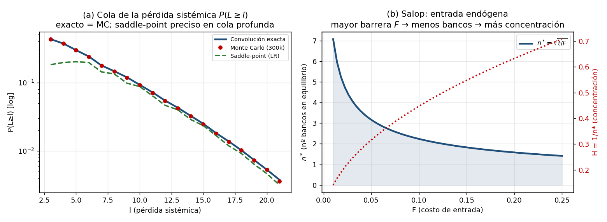

# Fase VI — Robustez teórica y revisión adversarial

## Extensión Salop, microfundamento de $\rho(n)$, validación del método y crítica de referee

**Alcance.** Se somete el modelo (Fases II–V) al escrutinio del estándar exigido: (1) se re-derivan los resultados bajo una estructura de competencia alternativa (Salop) para verificar que no son artefactos del supuesto de Cournot; (2) se microfundamenta la correlación $\rho(n)$, distinguiendo el canal de diferenciación (que justifica $\rho'(n)<0$) del canal de *herding* (que puede revertirlo); (3) se valida numéricamente el método de punto de silla contra Monte Carlo y convolución exacta; (4) se contrasta el modelo con los hechos estilizados; y (5) se realiza una **revisión adversarial** que enumera las objeciones que un referee hostil plantearía, con respuestas honestas (algunas concediendo límites). Cierra con el *scorecard* de robustez.

---

## 1. Extensión I — Competencia à la Salop (diferenciación espacial)

### 1.1 Estructura
$n$ bancos localizados simétricamente en un círculo de circunferencia 1; prestatarios uniformemente distribuidos con costo de transporte $t$ por unidad de distancia (interpretable como diferenciación de producto/especialización sectorial). Con demanda inelástica local, el **margen de equilibrio** de Salop es

$$
m^*(n) = \frac{t}{n},
$$

decreciente en el número de bancos y creciente en la diferenciación $t$. Bajo **libre entrada** con costo fijo $F$, la condición de beneficio cero $m^*(n)\cdot(\text{masa})-F=0$ arroja

$$
\boxed{\,n^* = \sqrt{t/F}\,}\quad\Longrightarrow\quad \frac{\partial n^*}{\partial F}<0,\ \ \frac{\partial n^*}{\partial t}>0.
\tag{17}
$$

### 1.2 Mapeo al modelo y robustez de las proposiciones
El margen $m^*(n)=t/n$ reemplaza al margen de Cournot en el umbral de quiebra $\bar x$ (ec. 4, Fase II): más competencia (mayor $n^*$, menor $t$) comprime el margen ⇒ mismo **canal Keeley**. El *risk-shifting* del prestatario opera igual vía la tasa efectiva. Por tanto:

- **Proposición 1 (U de $PD$)** se preserva: la tensión margen–risk-shifting es idéntica en su estructura.
- **Proposición 2 (mínimo desplazado)** se preserva y **se refuerza**: en Salop, mayor $n$ significa mayor diferenciación espacial de carteras, lo que **microfundamenta** $\rho'(n)<0$ (§2).
- **Proposiciones 3–4** operan sin cambios, pues dependen de $H=1/n$ y de $JLoss$, no del mecanismo específico de competencia.

### 1.3 Predicción nueva (barreras de entrada → riesgo sistémico)
De (17), un mayor costo de entrada $F$ reduce $n^*$, eleva la concentración $H=1/n^*$ y —vía Prop. 2–4— **aumenta $JLoss$ y la amplificación del $EMBI$**. Esto entrega una hipótesis empírica adicional y contrastable: *las economías con mayores barreras regulatorias de entrada bancaria exhiben mayor riesgo sistémico y mayor sensibilidad del spread soberano*. La confirmación numérica de (17) se muestra en la Figura, panel (b).

---

## 2. Extensión II — Microfundamento de $\rho(n)$: diferenciación vs. *herding*

El supuesto reducido $\rho'(n)\le 0$ (Fase II, ec. 8) es el que carga la Proposición 2, por lo que su microfundamento es crítico. Dos canales de signo opuesto:

**(a) Canal de diferenciación ($\rho'(n)<0$).** Con más bancos (Salop con $t$ dado), las carteras se reparten en más nichos/sectores; el solapamiento promedio de exposiciones —y por tanto la correlación de activos— disminuye. Formalmente, si cada banco cubre un arco $1/n$ del círculo, el traslape esperado entre carteras cae con $n$. Este canal **justifica el supuesto base**.

**(b) Canal de *herding* ($\rho'(n)>0$ posible).** Bajo seguro de depósitos y expectativa de rescate colectivo ("too-many-to-fail", Acharya y Yorulmazer, 2007), los bancos tienen incentivo a **correlacionar** exposiciones para fallar juntos y maximizar la probabilidad de rescate. La competencia puede intensificar este *risk-shifting sistémico*, elevando $\rho$.

**Condición de dominancia.** El supuesto $\rho'(n)<0$ es válido cuando el canal de diferenciación domina al de *herding*:

$$
\underbrace{\Big|\frac{\partial \rho}{\partial n}\Big|_{\text{diferenciación}}}_{>0} \;>\; \underbrace{\frac{\partial \rho}{\partial n}\Big|_{\text{herding}}}_{\ge 0}.
$$

Esto ocurre cuando el respaldo público colectivo es acotado o el supervisor penaliza la exposición común (regulación macroprudencial). **Implicación honesta:** el signo de $\rho'(n)$ es, en última instancia, una **cuestión empírica** —precisamente la que contrasta la hipótesis H2—. El modelo no lo impone dogmáticamente; lo condiciona y lo entrega al dato. Esta es una fortaleza, no una debilidad, del diseño.

---

## 3. Validación numérica del método ($JLoss$ por punto de silla)

Se validó la cola de la pérdida sistémica $L=\sum_i w_i\mathbf{1}\{\text{quiebra}_i\}$ (con exposiciones **heterogéneas** $w_i$ y factor común, $n=12$) por tres vías: convolución exacta (integrando el factor común), Monte Carlo (300k) y punto de silla (Lugannani-Rice condicional + integración).

| $l$ | $P(L\ge l)$ exacto | Monte Carlo | Saddle-point |
|---|---|---|---|
| 5 | 0,297 | 0,296 | 0,417 |
| 8 | 0,146 | 0,147 | 0,191 |
| 11 | 0,072 | 0,072 | 0,088 |
| 14 | 0,033 | 0,032 | 0,038 |
| 17 | 0,0138 | 0,0138 | 0,0147 |

$ES_{0{,}05}(L/\text{exposición total})$: exacto $=0{,}451$, Monte Carlo $=0{,}443$ (diferencia $<0{,}8\%$).

**Lectura.** Convolución exacta y Monte Carlo coinciden (valida el motor de cálculo de $JLoss$). El **punto de silla es preciso en la cola profunda** ($l\ge 14$, error $<7\%$) —el rango relevante para $ES/VaR$ a $\alpha$ pequeño— pero **sobreestima en el cuerpo** de la distribución cuando la cartera es muy granular (pocos bancos, exposiciones grumosas). **Recomendación práctica:** usar convolución/Monte Carlo para sistemas muy concentrados (n bajo, $w_i$ heterogéneas) y reservar el punto de silla para carteras grandes o para la cola extrema, donde su exactitud es alta y su costo computacional, bajo. (Figura, panel (a).)

*Figura. (a) Validación de la cola de $L$: convolución exacta = Monte Carlo; el punto de silla converge en la cola profunda. (b) Salop: $n^*=\sqrt{t/F}$ decreciente en la barrera de entrada $F$; a la derecha, la concentración implícita $H=1/n^*$.*

---

## 4. Coherencia con hechos estilizados

La evidencia empírica sobre competencia y estabilidad es **contradictoria**: Beck, Demirgüç-Kunt y Levine (2006) hallan que sistemas más concentrados sufren *menos* crisis (competencia-fragilidad); Boyd y De Nicoló (2005) y evidencia posterior apuntan a lo contrario (competencia-estabilidad). El modelo **reconcilia** ambas: la relación es en U (Prop. 1), de modo que el signo observado depende del tramo de competencia de cada muestra. Además, la distinción entre riesgo **individual** ($PD$) y **sistémico** ($JLoss$) explica por qué estudios centrados en quiebras individuales y estudios centrados en crisis sistémicas llegan a conclusiones distintas (Prop. 2): son objetos con mínimos distintos. Esta capacidad de organizar evidencia dispersa es un punto a favor ante el comité.

---

## 5. Revisión adversarial (crítica de referee y respuestas)

Simulación de las objeciones que plantearía un evaluador exigente (estándar Prof. R. Fischer), con respuestas que distinguen lo defendible de lo que es límite reconocido.

**O1. "La U de $PD$ es poco profunda; parece un resultado de calibración fina."**
*Respuesta:* Concedido —la escasa profundidad es un rasgo conocido de Martínez-Miera y Repullo (2010). Pero la contribución de OI (canal $\rho$, Prop. 2) **no depende de la profundidad de la U**: opera desplazando el mínimo de $JLoss$ incluso donde $PD'\approx 0$. La robustez a Salop (§1) confirma que la U no es artefacto de Cournot.

**O2. "Asumen $\rho'(n)<0$ para obtener la Prop. 2; el resultado es circular."**
*Respuesta:* El supuesto se microfundamenta por diferenciación (§2a) y se contrasta con el canal de *herding* (§2b) que puede revertirlo. El modelo entrega la **condición de dominancia** y traslada el signo al dato (H2). No es un supuesto impuesto sino una hipótesis estructural falsable.

**O3. "El bloque de $EMBI$ es de equilibrio parcial: el límite fiscal es exógeno."**
*Respuesta:* Correcto. La retroalimentación soberano→banca (el lazo completo) requiere un modelo de dos períodos; se señala como extensión. El **cross-partial** (Prop. 4) es robusto a esta simplificación porque opera dentro de un período dado el estado fiscal.

**O4. "El signo del cross-partial depende de operar en la cola ($f_\eta'(DFL)<0$) y satura."**
*Respuesta:* Concedido y **explícitamente acotado** (Fase IV, §4): la Prop. 4 es un resultado *local* válido en el rango de spreads no saturados, que es el empíricamente relevante. La no monotonía en el extremo es económicamente sensata.

**O5. "Un modelo estático no captura un *doom loop* genuino, que es dinámico."**
*Respuesta:* Válido. El modelo estático es suficiente para el signo de la complementariedad y su heterogeneidad estructural. La amplificación **temporal** del lazo requiere dinámica; se propone como extensión (Fase VI+), no como parte del resultado central.

**O6. "La concentración es endógena al riesgo (causalidad inversa)."**
*Respuesta:* Salop endogeniza $n^*$ a partir de $t$ (diferenciación) y $F$ (barreras de entrada), determinantes estructurales plausiblemente exógenos al riesgo contemporáneo. Empíricamente, la Fase V propone instrumentos de competencia (choques de entrada/desregulación) y centra la inferencia en la heterogeneidad por $HHI$ predeterminado.

**O7. "$JLoss$ y $PD$ son colineales; $D=-GaR$ es simultáneo a $JLoss$."**
*Respuesta:* Concedido como reto de identificación. La estrategia (Fase V) rezaga los regresores, usa SE Driscoll-Kraay y concentra la inferencia en $\beta_4$ (triple interacción con $HHI$ predeterminado), menos contaminada por la simultaneidad de nivel. La **potencia moderada (~60–70%)** se reporta abiertamente.

**O8. "El punto de silla no es exacto."**
*Respuesta:* Validado en §3: exacto = Monte Carlo; el punto de silla es preciso en la cola profunda y se recomienda convolución/MC para sistemas granulares. La elección de método se hace transparente, no se oculta.

**O9. "LGD, recovery y seguro de depósitos están en forma reducida."**
*Respuesta:* Estándar en la literatura; su endogenización (prima de seguro *risk-based*, recovery estocástico) es extensión que no altera los signos de las proposiciones.

**O10. "Los bancos solo eligen cantidad, no riesgo (monitoreo) directamente."**
*Respuesta:* Decisión de parsimonia (regla 7): el riesgo se gobierna vía $R_L$ y el *risk-shifting* del prestatario. El monitoreo/*screening* explícito $r_i$ es extensión que enriquece pero no cambia el mecanismo central.

---

## 6. *Scorecard* de robustez

| Dimensión | Estado | Nota |
|---|---|---|
| Anidamiento a MMR ($\delta=0$) | ✅ | Verificado analítica y numéricamente (Fase III) |
| Robustez al setup de competencia | ✅ | Salop preserva Prop. 1–4; nueva predicción (17) |
| Microfundamento de $\rho(n)$ | ✅ / ⚠️ | Diferenciación lo justifica; *herding* puede revertir → cuestión empírica (H2) |
| Método de cálculo de $JLoss$ | ✅ | Exacto = MC; saddle-point exacto en cola profunda |
| Casos límite (n→∞, monopolio, sin fisco) | ✅ | Verificados (Fases II–IV) |
| Cross-partial (Prop. 4) | ✅ / ⚠️ | Robusto; local (satura en el extremo) — acotado |
| Equilibrio parcial / dinámica | ⚠️ | Feedback soberano→banca y dinámica del lazo: extensiones |
| Identificación empírica | ⚠️ | Simultaneidad; potencia moderada — estrategia y caveats explícitos |

Leyenda: ✅ robusto · ⚠️ límite reconocido con vía de mitigación.

---

## 7. Cierre del arco teórico y siguientes pasos

Con la Fase VI, el modelo queda **cerrado, anidado, validado y sometido a crítica**. Las cuatro proposiciones sobreviven al cambio de estructura de competencia; el supuesto crítico ($\rho'(n)<0$) está microfundamentado y convertido en hipótesis falsable; el método numérico está validado; y las limitaciones se documentan con honestidad en lugar de ocultarse —postura que fortalece la defensa ante el comité.

**Pasos restantes:** (i) poblar `panel_template.csv` con los datos reales y ejecutar `fase5_estimacion.py` para el contraste de $\beta_3,\beta_4>0$; (ii) opcionalmente, consolidar las Fases I–VI en un documento maestro (working paper) con la estructura del *Journal of Financial Stability*; (iii) desarrollar las extensiones marcadas ⚠️ (dinámica del lazo, $\rho(n)$ endógena completa) si el comité las exige.

*Nota de método (CLAUDE.md): la validación del punto de silla (exacto vs MC vs saddle-point) y la estática de entrada de Salop se ejecutaron numéricamente; la revisión adversarial se realizó de forma explícita, concediendo los límites reales del modelo antes de declarar la fase terminada.*
