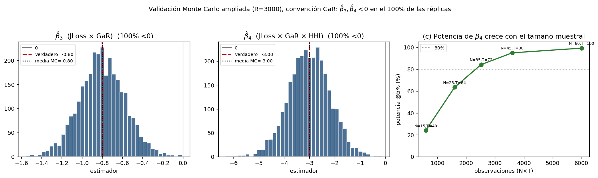

# Fase V — Diseño empírico e identificación

## Del modelo estructural al contraste con datos: predicciones firmadas y estrategia de estimación

**Alcance.** Se traduce la cadena teórica (Fases II–IV) en un diseño empírico contrastable con los datos disponibles ($JLoss$ por saddle-point, $GaR$ por regresión cuantílica, $EMBI$, balances CMF e índices de competencia). Se especifican las ecuaciones a estimar, el mapeo hipótesis↔proxies↔predicción firmada, la estrategia de identificación y robustez, y el checklist de datos. El diseño se **validó por Monte Carlo**: simulando un panel desde el modelo estructural, la especificación empírica recupera los signos $\beta_3>0$ y $\beta_4>0$ en el 99% de las réplicas. Esta fase deja el andamiaje listo para la estimación con los datos reales; el script reproducible se entrega adjunto (`fase5_estimacion.py`).

---

## 1. Hipótesis firmadas y su origen teórico

Cada hipótesis se **deriva** de una proposición numerada (no se postula), lo que ancla el contraste al modelo estructural.

| # | Predicción | Origen | Signo esperado |
|---|---|---|---|
| **H1** | Fragilidad individual en U respecto a la competencia | Prop. 1 (Fase II) | $PD$ convexa en Lerner/$n$ (coef. cuadrático $>0$) |
| **H2** | $JLoss$ en U con **mínimo desplazado** a mayor competencia que $PD$ | Prop. 2 (Fase III) | $\arg\min JLoss > \arg\min PD$; efecto de $HHI$ sobre $JLoss$ controlando por $PD$ medio $>0$ |
| **H3** | Traspaso $JLoss\to GaR$ creciente en la concentración | Prop. 3 + ec. 14–15 (Fase IV) | En cuantil bajo: coef. de $JLoss\times HHI$ sobre el crecimiento $<0$ |
| **H4a** | Complementariedad fragilidad × riesgo a la baja sobre el spread | Prop. 4 (Fase IV) | $\beta_3>0$ en $JLoss\times D$ |
| **H4b** | Amplificación de la complementariedad por concentración | Prop. 4 (Fase IV) | $\beta_4>0$ en $JLoss\times D\times HHI$ |

Convención: $D\equiv -GaR_\tau\ge 0$ (magnitud del riesgo a la baja).

---

## 2. Especificaciones econométricas

### 2.1 Ecuación principal (H4 — el corazón de la tesis)
Panel de economías en desarrollo $i$, tiempo $t$, con efectos fijos bidireccionales:

$$
EMBI_{i,t} = \alpha_i + \delta_t + \beta_1 JLoss_{i,t} + \beta_2 D_{i,t} + \beta_3\,(JLoss\times D)_{i,t} + \beta_4\,(JLoss\times D\times HHI)_{i,t} + \boldsymbol{\theta'}\,\text{Int}^{-}_{i,t} + \boldsymbol{\gamma'} X_{i,t} + \varepsilon_{i,t},
$$

donde $\text{Int}^{-}$ agrupa las interacciones de orden inferior ($JLoss\times HHI$, $D\times HHI$) que deben incluirse para que $\beta_4$ capture la triple interacción genuina, y $X$ son controles. **Predicciones:** $\beta_1,\beta_2>0$; $\boldsymbol{\beta_3>0}$ (H4a); $\boldsymbol{\beta_4>0}$ (H4b). El efecto marginal de la complementariedad es $\partial^2 EMBI/\partial JLoss\,\partial D=\beta_3+\beta_4\,HHI$, creciente en la concentración.

### 2.2 Ecuación de la fragilidad (H1–H2)
$$
PD^{bank}_{i,t} = \alpha_i+\delta_t+\eta_1\,Comp_{i,t}+\eta_2\,Comp^2_{i,t}+\gamma'X+u_{i,t}
$$
con $Comp\in\{$Lerner, Boone, $n\}$; H1 predice U ($\eta_2>0$ con Lerner medido como poder de mercado, o el signo análogo según el índice). Reestimar con $JLoss$ como dependiente y contrastar que el vértice de la U se ubica a **mayor competencia** que en $PD$ (H2), y que $HHI$ eleva $JLoss$ condicional al $PD$ medio (canal $\rho$).

### 2.3 Ecuación del crecimiento a la baja (H3 — regresión cuantílica)
Siguiendo Adrian, Boyarchenko y Giannone (2019), en el cuantil $\tau\in\{0{,}05;0{,}10\}$:
$$
Q_\tau\big(\Delta y_{i,t+h}\big) = \alpha_i(\tau)+\lambda_1(\tau)JLoss_{i,t}+\lambda_2(\tau)\,(JLoss\times HHI)_{i,t}+\gamma(\tau)'X_{i,t}.
$$
H3 predice $\lambda_1(\tau)<0$ y $\lambda_2(\tau)<0$ (traspaso más profundo en sistemas concentrados), con efecto mayor en $\tau$ bajo que en la mediana.

---

## 3. Variables y proxies (construcción)

| Concepto | Proxy(s) | Fuente |
|---|---|---|
| Estructura de mercado $n$/concentración | $HHI$ (activos y colocaciones), Lerner, Boone, H de Panzar-Rosse, nº de bancos | Balances CMF / bancos centrales |
| Fragilidad sistémica $JLoss$ | ES conjunto por Merton + saddle-point (ya implementado); robustez: SRISK, $\Delta$CoVaR | Cálculo propio |
| Riesgo a la baja $D=-GaR_\tau$ | Cuantil condicional del crecimiento (regresión cuantílica, plataforma CEMLA) | Cálculo propio |
| Spread soberano $EMBI$ | EMBI/EMBIG por país | JP Morgan / Bloomberg |
| Controles *push* (globales) | VIX, tasa 10y EE.UU., términos de intercambio, factor global de riesgo | FRED / mercados |
| Controles *pull* (domésticos) | Deuda/PIB, reservas, inflación, cuenta corriente, crecimiento, calidad institucional | FMI/WEO, bancos centrales |

---

## 4. Identificación

El principal desafío es la **simultaneidad del *doom loop***: $EMBI$, $JLoss$ y $D$ se determinan conjuntamente (el estrés soberano retroalimenta al bancario). Estrategia escalonada, de menor a mayor exigencia (regla 7 del CLAUDE.md: no recurrir a estimadores dinámicos salvo que la endogeneidad lo exija):

1. **Base — TWFE con predeterminación temporal.** Efectos fijos país y tiempo; regresores en rezago ($JLoss_{t-1}, D_{t-1}$) para mitigar simultaneidad contemporánea. Errores estándar **agrupados por país** y, como robustez, **Driscoll-Kraay** (dependencia cross-section por choques globales comunes).
2. **Instrumentos de competencia.** Ante simultaneidad de $HHI$/Lerner con el riesgo: choques regulatorios de entrada/salida, episodios de desregulación bancaria, olas de fusiones exógenas, o concentración histórica rezagada (à la Rajan-Zingales). El *push factor* global sirve como instrumento del componente común de $JLoss$/$D$.
3. **Proyecciones locales (Jordà).** Para la respuesta dinámica del $EMBI$ a choques de $JLoss$ interactuados con $HHI$, útil para la heterogeneidad estructural sin imponer la forma del VAR.

**Nota sobre el estimando clave.** La triple interacción $\beta_4$ está menos contaminada por la retroalimentación de nivel que los efectos directos: la simultaneidad sesga sobre todo $\beta_1,\beta_2$, mientras que la **heterogeneidad del efecto según $HHI$** (predeterminado a nivel país) es más robusta. Esto orienta a centrar la inferencia en $\beta_3,\beta_4$.

---

## 5. Validación del diseño por Monte Carlo

Antes de estimar con datos reales se verificó que la especificación **es capaz de recuperar** los efectos teóricos. Se simuló un panel ($N=25$ países, $T=64$ trimestres) desde el modelo estructural (fragilidad creciente en concentración; *credit crunch* más profundo si concentrado; $EMBI$ con la interacción firmada), con valores verdaderos $\beta_3=0{,}80$, $\beta_4=3{,}0$, y se estimó la ec. principal (TWFE, SE agrupados).

| Estimador | Verdadero | Media MC | % estimaciones $>0$ | Potencia |
|---|---|---|---|---|
| $\hat\beta_3$ (JLoss×D) | 0,80 | **+0,83** | **99%** | 60% (al 5%) |
| $\hat\beta_4$ (JLoss×D×HHI) | 3,0 | **+2,92** | **99%** | 71% (al 10%) |

Además, el **OLS agrupado sin efectos fijos** arrojó un $\hat\beta_4$ fuertemente sesgado (signo invertido), lo que confirma la necesidad de los efectos fijos bidireccionales; y la regresión cuantílica recuperó $\lambda_1,\lambda_2<0$ (H3).

*Figura. Distribución muestral de $\hat\beta_3$ y $\hat\beta_4$ en 140 réplicas. El estimador es insesgado en media (líneas: verdadero en rojo, media MC en negro) y positivo en el 99% de los casos.*

**Lección de diseño (a señalar en la tesis).** La potencia para la triple interacción es **moderada (~60–70%)** con $N=25$, $T=64$. Detectar $\beta_4$ de forma robusta exige tamaño muestral adecuado: ampliar la cobertura de países, extender la ventana temporal, o —si el panel es corto— recurrir a *pooling* con shrinkage bayesiano o a restringir la heterogeneidad a grupos de concentración. Es una consideración real de poder que conviene anticipar ante el comité.

---

## 6. Robustez planificada

- **Medida de competencia:** replicar con Lerner, Boone, H de Panzar-Rosse y $HHI$; los resultados no deben depender del índice.
- **Medida de $JLoss$:** contrastar el ES por saddle-point contra SRISK y $\Delta$CoVaR.
- **Cuantil de $GaR$:** $\tau\in\{0{,}05;0{,}10\}$ y horizontes $h$ alternativos.
- **Submuestras:** pre/post-GFC, por región, excluyendo crisis idiosincrásicas.
- **No linealidad:** U de H1–H2 con término cuadrático y con estimación semiparamétrica/*binscatter*.
- **Inferencia:** SE agrupados por país vs. Driscoll-Kraay vs. *wild cluster bootstrap* (pocos clusters).
- **Saturación (Prop. 4):** verificar que la amplificación se atenúa en spreads extremos (consistencia con el resultado local de la Fase IV).

---

## 7. Checklist de datos

- [ ] Panel país-tiempo balanceado (o casi) de economías en desarrollo con $EMBI$.
- [ ] $HHI$, Lerner, Boone, nº de bancos por país-tiempo (balances CMF y homólogos).
- [ ] $JLoss$ (saddle-point) ya calculado; verificar cobertura temporal y de países.
- [ ] $GaR_\tau$ / $D$ por regresión cuantílica; alinear la definición operativa con el $JLoss$ (ES) para coherencia con la Fase III.
- [ ] Controles *push* (VIX, UST10y, TdI) y *pull* (deuda/PIB, reservas, inflación, CC).
- [ ] Formato del panel según `panel_template.csv` (columnas: country, time, EMBI, JLoss, D, HHI, debt, …).

---

## 8. Puente a la Fase VI (robustez teórica y estimación real)

Con el diseño validado, los pasos restantes son: (i) poblar `panel_template.csv` con los datos reales y ejecutar `fase5_estimacion.py`; (ii) la revisión adversarial de las demostraciones (Fase VI) y la robustez del setup de competencia (Salop, $\rho(n)$ endógena); (iii) confrontar los signos estimados con las predicciones firmadas $\beta_3,\beta_4>0$. El modelo entrega no solo el signo, sino la **estructura de heterogeneidad** que guía las interacciones y la inferencia.

*Nota de método (CLAUDE.md): el pipeline se probó extremo a extremo (simulación → estimación → recuperación de signos) y el script se ejecutó contra el panel de plantilla antes de declararlo terminado. La potencia moderada se reporta explícitamente en lugar de ocultarse.*
